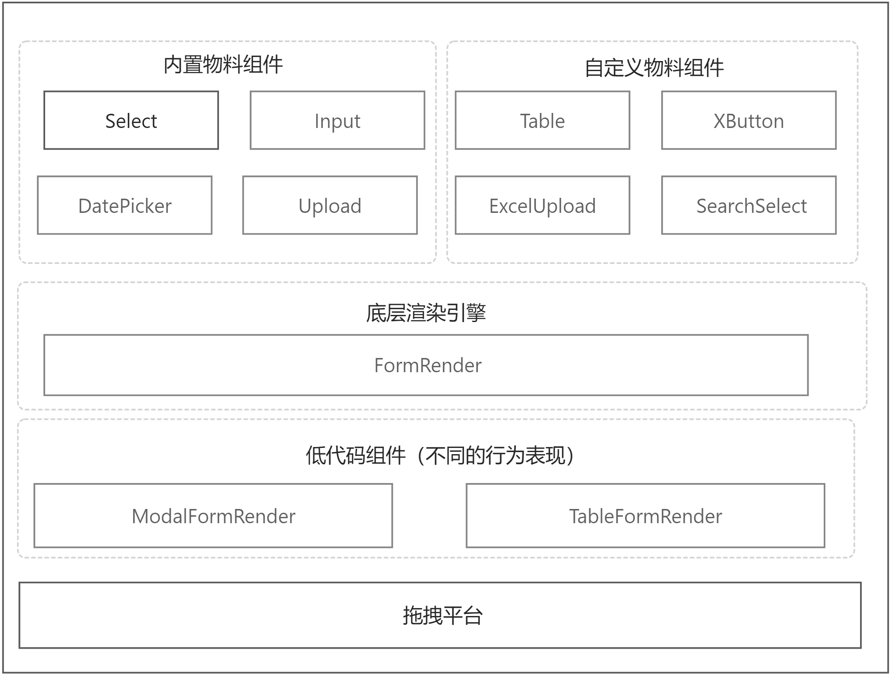

# 什么是 FormRender

过去发现团队的每个小伙伴写表单业务都存在不同的写法，每个人都是**千人千面的写法**，对于后续进来维护的人来说，尽管有 eslint 和 prettier 去限制代码风格，而且 react 的写法过于灵活，各地方的调用不统一，造成很多时候需要额外增加成本去熟悉不同的人的代码习惯，那如何去让每个人写得代码都是统一呢？达到多个人写得代码都是相同的呢？

答案：**「声明式的结构化对象」**。

与 [x-render](https://x-render.gitee.io/) 和 [Formily](https://formilyjs.org/zh-CN) 的区别？

1. Ts 的强类型提醒
2. 上手成本较低
3. 可扩展性强（能够抽出核心的 Render 函数，内嵌到不同的 Form 组件中）
4. 自动收集依赖字段，防止表单项的全量更新
5. 单个表单的字段通常需要多个
6. 丰富的内置组件预设

# 借助底层的 FormRender 来扩展更多周边生态

